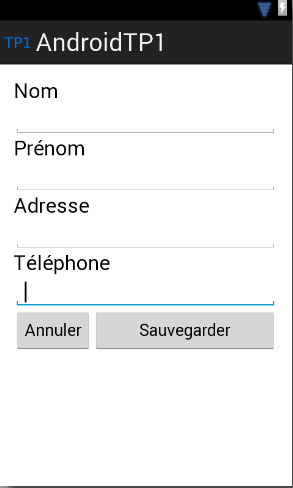
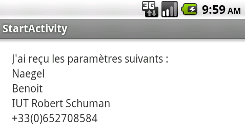

# TP1 : Prise en main du framework

## Instructions 

- faire des commits réguliers et commentés à bon escient
- faire un push en fin de séance

## Cycle de vie d'une activité

Créer une application composée d'une seule activité qui affiche un `Toast` à chaque changement d'état.

## Formulaire et changement d'activité

Créer une application composée de deux activités :

- dans l'activité principale, l'utilisateur saisit son nom, prénom, numéro de téléphone. Un bouton "Effacer" permet d'effacer tous les champs.
Le bouton "Envoyer" permet d'envoyer les informations à une seconde Activité.
- la seconde activité réceptionne les données et les affiche de manière structurée à l'écran.
L'interface utilisateur utilise un layout de type `LinearLayout` et ressemble à ça :

La seconde Activité affichera les éléments envoyés :

- remplacer ensuite le `LinearLayout` par un `RelativeLayout`
- internationaliser l'application, en rajoutant au moins la langue anglaise
- sauvegarder les champs saisis dans les préférences partagées : les champs sont restaurés quand l'application est relancée